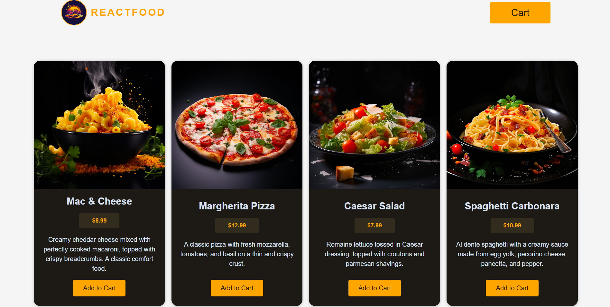
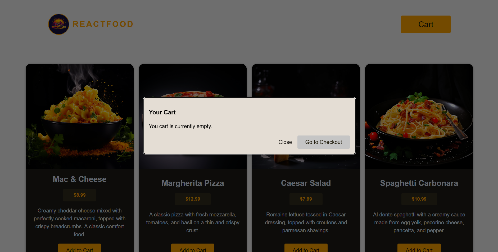
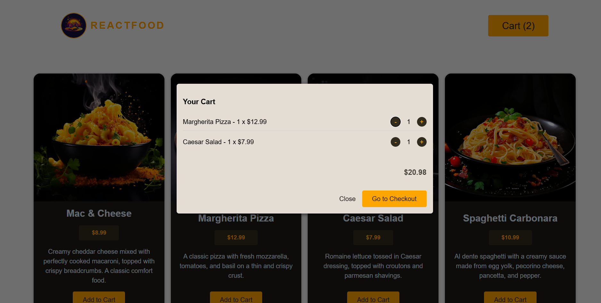
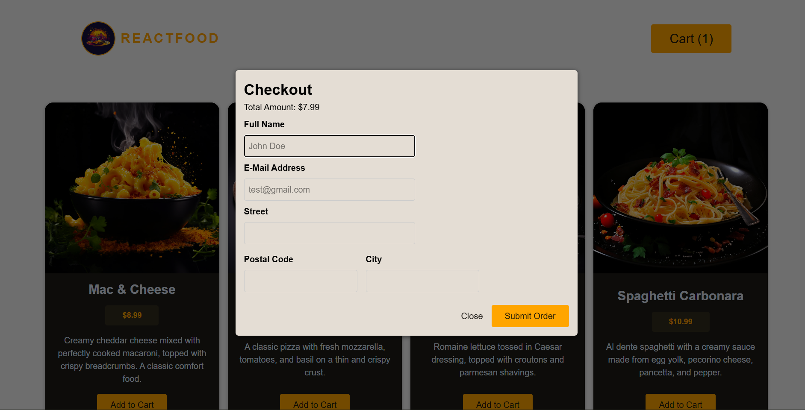

# React Food Order App

This project is my fourth project in my react learning journey in **React- The Complete Guide By Maximilian Shwarzmuller** , in this project i got exposed to various topics and patterns in react that i practiced on:

- Using **Context** in react with **useReducer()** hook to manage complex Cart state along the component tree
- Using **useEffect()** hook to communicate with backend in a smooth way , **Managing a reusable Modal Component.**
- Using **useActionState()** to handle form **submission** and **validation** and through it i managed **loading** and **error** state in react.
- Got exposed to a full real world flow scenario that i can use in my future projects



## App.jsx

```
function App() {
  return (
    <UserProgressContextProvider>
      <CartContextProvider>
        <Header />
        <Meals />
        <Cart />
        <Checkout />
        <CheckoutResult />
      </CartContextProvider>
    </UserProgressContextProvider>
  );
}
```

**App.jsx** where my code starts , two contexts wrap my main components .

**Header** , **Meals** are the main static components that are always there , while the others are using my **reusable Modal** component.

## Header.jsx

```
export default function Header() {
  const userProgressCtx = use(UserProgressContext);

  function handleShowCart() {
    userProgressCtx.showCart();
  }


  return (
    <header id="main-header">
      <div id="title">
        
        <h1>REACTFOOD</h1>
      </div>
      <CartButton onOpenModal={handleShowCart} />
    </header>
  );
}
```

My **Header** component where user can open the cart using **UserProgressContext** that monitor what the user is currently doing ('cart' , 'checkout' , 'orderResult').

## Modal.jsx

```
import { createPortal } from "react-dom";
import { useEffect, useRef } from "react";

export default function Modal({ open, onClose, children, className = "" }) {
  const thisModal = useRef();

  useEffect(() => {
    if (open) {
      thisModal.current.showModal();
    } else {
      thisModal.current.close();
    }
  }, [open]);

  return createPortal(
    <dialog ref={thisModal} className={`modal ${className}`} onCancel={onClose}>
      {children}
    </dialog>,
    document.getElementById("modal"),
  );
}
```

**Modal.jsx** one of the most important Component in my project where its used by **Cart** , **Checkout** , **CheckoutResult**.

Using **createPortal()** i allow it to render in the exact place that i want it **specified in the second argument**.

## Cart.jsx

```
export default function Cart() {
  const { items } = use(CartContext);
  const userProgressCtx = use(UserProgressContext);
  let cartIsEmpty = items.length === 0;

  const cartTotal = calculateCartTotal(items);

  function handleCloseCart() {
    userProgressCtx.hideCart();
  }

  function handleShowCheckout() {
    userProgressCtx.showCheckout();
  }

  let content = <p>You cart is currently empty.</p>;

  if (!cartIsEmpty) {
    content = (
      <>
        <ul>
          {" "}
          {items.map((item) => (
            <CartItem key={item.id} item={item} />
          ))}{" "}
        </ul>{" "}
        <p className="cart-total">{currencyFormatter.format(cartTotal)}</p>
      </>
    );
  }

  return (
    <Modal className="cart" open={userProgressCtx.progress === "cart"}>
      <h2>Your Cart</h2>
      {content}
      <p className="modal-actions">
        <Button textOnly onClick={handleCloseCart}>
          Close
        </Button>
        <Button
          className={`button ${cartIsEmpty ? "unclickable" : ""}`}
          onClick={handleShowCheckout}
          disabled={cartIsEmpty}
        >
          Go to Checkout
        </Button>
      </p>
    </Modal>
  );
}
```

### Empty Cart



### Active Cart



To control the cart among the component tree i used **Context** which allowed me to create a shareable object that contains an array called **items** as well as other functions that **Manage the cart**.

To control the visibility of the cart i used another **Context** that owns functions that handle the user current progress and set a state called **progress** with the following values :

- cart (User showing cart Modal)
- checkout (User showing checkout Modal)
- orderResult (User showing result Modal)

## Checkout

```
async function addOrder(order, showResult) {
  try {
    const response = await fetch("http://localhost:3000/orders", {
      method: "POST",
      body: JSON.stringify(order),
      headers: {
        "Content-Type": "application/json",
      },
    });

    if (!response.ok) {
      return {
        success: false,
        message: response.message,
      };
    }

    return { success: true };
  } catch (error) {
    return { success: false, message: "Could not connect to server" };
  }
}

async function submitOrderAction(
  items,
  showResult,
  clearCart,
  prevState,
  formData,
) {
  const fullName = formData.get("fullName");
  const email = formData.get("email");
  const street = formData.get("street");
  const postalCode = formData.get("postalCode");
  const city = formData.get("city");

  let errors = {};

  if (isEmpty(fullName)) {
    errors.fullName = "Fullname is required.";
  }

  if (!isValidEmail(email)) {
    errors.email = "Please enter a valid email.";
  }

  if (isEmpty(street)) {
    errors.street = "Street is required.";
  }

  if (!isValidPostalCode(postalCode)) {
    errors.postalCode = "Please enter a valid postal code.";
  }

  if (isEmpty(city)) {
    errors.city = "City is required";
  }

  if (Object.keys(errors).length > 0) {
    return {
      errors,
      enteredValues: {
        fullName,
        email,
        street,
        postalCode,
        city,
      },
    };
  }

  // Submit to backend
  const orderIsSubmitted = await addOrder({
    order: {
      items,
      customer: { fullName, email, street, postalCode, city },
    },
  });

  if (orderIsSubmitted.success) {
    clearCart();
  }
  showResult(orderIsSubmitted.success);

  return { errors: null };
}

export default function Checkout() {
  const { items, clearCart } = use(CartContext);
  const { progress, hideCheckout, showResult } = use(UserProgressContext);

  const boundSubmitAction = submitOrderAction.bind(
    null,
    items,
    showResult,
    clearCart,
  );

  const [formState, formAction, submitPending] = useActionState(
    boundSubmitAction,
    {
      errors: null,
    },
  );

  const cartTotal = calculateCartTotal(items);

  function handleCloseCheckout() {
    hideCheckout();
  }

  return (
    <Modal open={progress === "checkout"}>
      <h2 className="modal-title">Checkout</h2>
      <p>Total Amount: {currencyFormatter.format(cartTotal)}</p>

      <form action={formAction}>
        <Input
          label="Full Name"
          id="fullName"
          name="fullName"
          type="text"
          placeholder="John Doe"
          error={formState.errors?.fullName}
          defaultValue={formState.enteredValues?.fullName}
        />

        <Input
          label="E-Mail Address"
          id="email"
          name="email"
          type="email"
          placeholder="test@gmail.com"
          error={formState.errors?.email}
          defaultValue={formState.enteredValues?.email}
        />

        <Input
          label="Street"
          id="street"
          type="text"
          name="street"
          error={formState.errors?.street}
          defaultValue={formState.enteredValues?.street}
        />

        <div className="control-row">
          <Input
            label="Postal Code"
            id="postal"
            type="text"
            name="postalCode"
            error={formState.errors?.postalCode}
            defaultValue={formState.enteredValues?.postalCode}
          />
          <Input
            label="City"
            id="city"
            type="text"
            name="city"
            error={formState.errors?.city}
            defaultValue={formState.enteredValues?.city}
          />
        </div>
        <p className="modal-actions">
          <Button textOnly type="button" onClick={handleCloseCheckout}>
            Close
          </Button>
          <Button className="button" disabled={submitPending}>
            {submitPending ? "Submitting..." : "Submit Order"}
          </Button>
        </p>
      </form>
    </Modal>
  );
}

```



**Checkout** Component where order submitting happens , user submits his data and using **useActionState()** hook i handle the submission and validation of data and the loading state.
